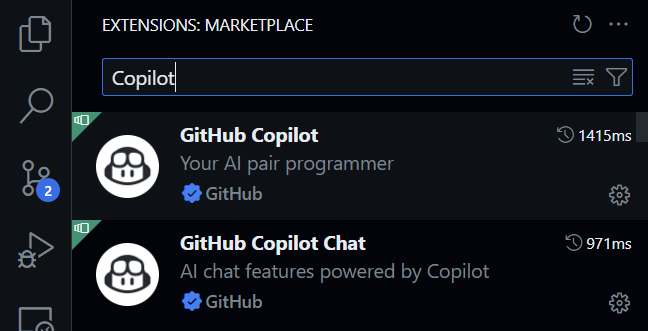
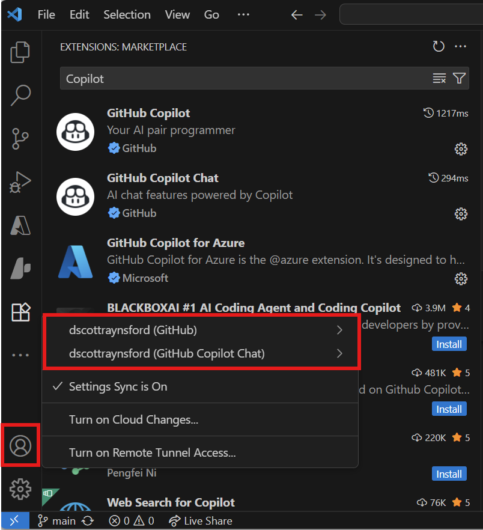

# GitHub Copilot Workshop for Microsoft Student Accelerator 2025

Welcome, future software rockstars!

Ready to launch your career and code like a pro? The **Microsoft Student Accelerator 2025** is your backstage pass to the world of AI-powered development! Whether you’re about to toss your graduation cap or just dreaming of your first big tech job, this workshop is your ticket to building the next generation of apps—without writing a single line of code yourself.

In this hands-on, high-energy lab, you’ll team up with GitHub Copilot and Copilot Chat to create real applications from scratch. You’ll be the architect, the visionary, and the creative force—while Copilot handles the heavy lifting. It’s not just about learning tools; it’s about reimagining what it means to be a developer in the age of AI.

So buckle up, bring your ideas, and get ready to experience the future of software engineering. Let’s build, innovate, and have some serious fun along the way!

> [!IMPORTANT]
> Before you attend the workshop, make sure you’ve checked off the prerequisites below so you can dive right in and make the most of this experience. ✅

## Prerequisites 📝

Before you join the workshop, please ensure you have the following set up on your machine:

- ✅ [GitHub account](https://github.com/) 🐙
- ✅ [Sign-up for GitHub Copilot Free](https://github.com/settings/copilot/features)
    
- ✅ [Git installed](https://git-scm.com/)
- ✅ [GitHub CLI installed](https://cli.github.com/) 🛠️
- ✅ [Visual Studio Code installed](https://code.visualstudio.com/) 💻
- ✅ [GitHub Copilot Extension installed in Visual Studio Code](https://marketplace.visualstudio.com/items?itemName=GitHub.copilot) 🤖
- ✅ [GitHub Copilot Chat extension installed in Visual Studio Code](https://marketplace.visualstudio.com/items?itemName=GitHub.copilot-chat) 💬
    
- 🛠️ (Optional) Any other Visual Studio Code extensions you’d like to use based on your preferred application stack (Prettier, ESLint, Python, etc.)
- 📖 (Optional) Complete the [Accelerate app development by using GitHub Copilot](https://learn.microsoft.com/en-us/training/paths/accelerate-app-development-using-github-copilot/) learning path to familiarize yourself with GitHub Copilot and Copilot Chat.

> [!IMPORTANT]
> Make sure you have signed into your GitHub account in Visual Studio Code so that GitHub Copilot is activated.
> Follow [these instructions](https://code.visualstudio.com/docs/copilot/setup) to ensure Github Copilot is enabled in Visual Studio Code.

## The Goal 🎯

The goal of this workshop is to empower you to build a fully functional application using Github Copilot and Copilot Chat. You’ll learn how to leverage AI to generate code, brainstorm ideas, and create specifications—all while collaborating with Copilot in real-time. By the end of the session, you'll be on your way to having a working application and a deeper understanding of how AI can transform your development process.

The key to using AI to create production ready applications is to provide grounding and context to the AI. This workshop will show you how to do that using the `simple_app_idea_generator` and `specification` chat modes.

## Workshop Agenda 📅

1. **Reimagining Development with Agentic DevOps** (15 mins) - 📖 [**Detailed Instructions**](workshop-step-1-reimagining-development-with-agentic-devops.md)
   - GitHub Copilot overview
   - Building your own AI centric engineering process

2. **Agent Mode & Custom Chat Modes** (25 mins) - 📖 [**Detailed Instructions**](workshop-step-2-agent-mode-and-custom-chat-modes.md)
   - Fork this repository to your GitHub account
   - Clone your fork of this repository using GitHub CLI `gh repo clone <your-username>/github-copilot-for-msa`
   - Come up with your app idea with the `simple_app_idea_generator` chat mode
   - Discusss your idea with `mentor` chat mode and refine it, including deciding on the technology stack

3. **Prompt Files** (20 mins) - 📖 [**Detailed Instructions**](workshop-step-3-prompt-files.md)
   - Create your app specfication with the `/create_specification` custom prompt file
   - Create your implementation plan using a custom prompt file `/create_implementation_plan`.
   - Run a last review of your plan and specification with the `principal_software_engineer` chat mode

4. **Build your application** (25 mins) - 📖 [**Detailed Instructions**](workshop-step-4-build-your-application.md)
   - Use the `#new` Agent tool to scaffold your application
   - Ask Copilot in Agent mode to build your application from the Specification and Implementation Plan you created.

5. **Realworld Scenarios** (25 mins) - 📖 [**Detailed Instructions**](workshop-step-5-realworld-scenarios.md)
   - Explaining code with Copilot
   - Generating unit tests for your application
   - Refactoring existing code with Copilot

6. **Next Steps** (5 mins) - 📖 [**Detailed Instructions**](workshop-step-6-next-steps.md)
    - AI driven development will be a key part of your future career.
    - It is critical to keep developing your AI skills and knowledge and to lead the way in your future teams.

## Resources 📚

- [GitHub Copilot Assets Library](https://github.com/PlagueHO/github-copilot-assets-library) - Curated collection of prompts and examples
- [GitHub Copilot Awesome-Copilot Library](https://github.com/github/awesome-copilot) - Community-curated resources and examples
- [GitHub Copilot Chat Documentation](https://docs.github.com/en/copilot/chat) 📖
- [Visual Studio Code Documentation](https://code.visualstudio.com/docs) 📖
- [Microsoft Learn: Accelerate app development by using GitHub Copilot](https://learn.microsoft.com/en-us/training/paths/accelerate-app-development-using-github-copilot/) 📖
- [GitHub Copilot Custom Prompt Files](https://code.visualstudio.com/docs/copilot/copilot-customization#_prompt-files-experimental) 📖
- [GitHub Copilot Custom Chat Modes](https://code.visualstudio.com/docs/copilot/chat/chat-modes#_custom-chat-modes) 📖
