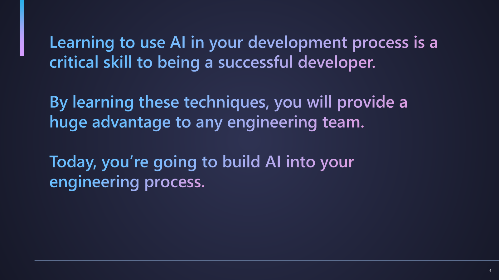
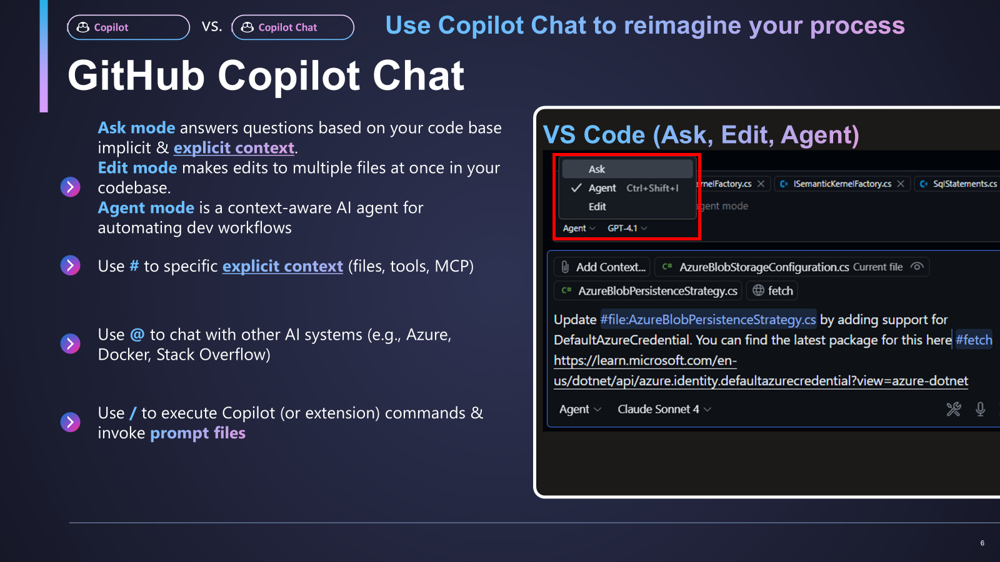
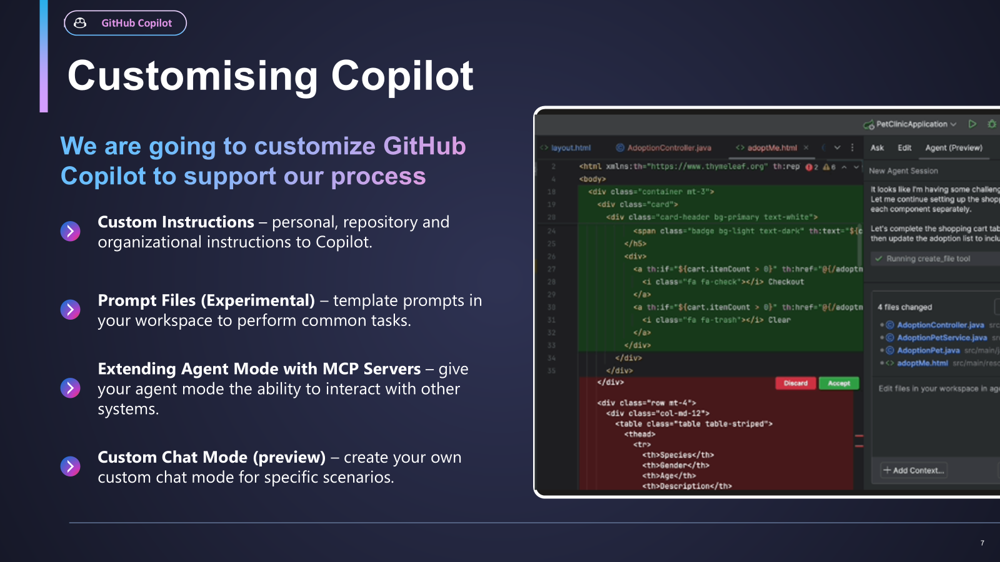
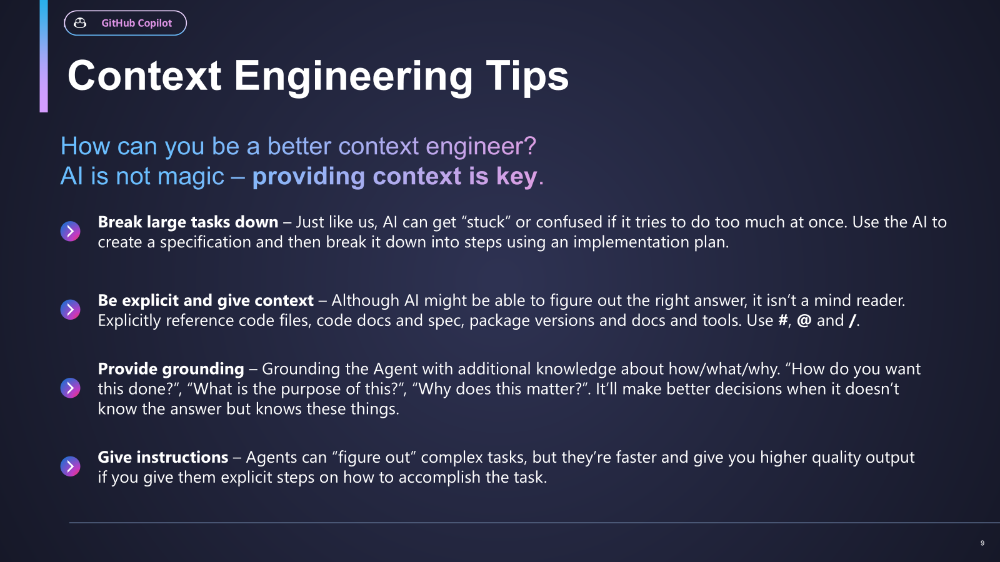

# Workshop Step 1: Reimagining Development with Agentic DevOps (10 minutes) 🚀💡

Welcome to the future of software development! This opening session sets the stage for your AI-powered development journey.

## Learning Objectives 🎯

- ✅ Learn about Agentic DevOps and how AI transforms the development process
- ✅ Understand the fundamentals of GitHub Copilot and AI-assisted development
- ✅ Prepare for the shift from traditional coding to Agentic AI collaboration
- ✅ Prepare to build your own AI-centric engineering process

## Session Overview 📋

This step is primarily a **facilitator-led presentation** covering:

### Part 1: GitHub Copilot Overview (15 minutes)

**Key topics covered in presentation:**

- Goals of the workshop and what you'll learn
- The increasing complexity of Software Development
- Introduction to Agentic DevOps
- What we are going to build together
- What is GitHub Copilot & GitHub Copilot Chat and how does it work?
- The importance of context - Context Engineering
- Customizing Copilot to reimagine your development workflow

## Mental Model Shift 🧠

**From:** Developer as code writer
**To:** Developer as architect, project manager, and AI collaborator

**You will have access to an AI team of:**

- 📋 **Product Manager**: Define product vision, features and requirements
- 🏗️ **Architect**: Design the overall solution and approach
- 💻 **Developer**: Write code with AI assistance, focusing on high-level logic
- 🎨 **UX Designer**: Focus on user experience and interface design
- 🛠️ **Process Owner**: Establish and maintain the development process
- 🎯 **Quality Guardian**: Review, test, and refine AI-generated solutions
- 🤝 **AI Collaborator**: Communicate effectively with AI tools
- 📚 **Documenter**: Maintain clear documentation for AI and human understanding
- 🚀 **SRE**: Ensure reliability and performance of AI-assisted applications
- 🔒 **Security Champion**: Integrate security best practices into AI workflows
- 📊 **Data Scientist**: Analyze data and provide insights for AI models
- ⚙️ **DevOps Engineer**: Automate deployment and operations with AI tools
- And more!

## Context Engineering Tips

How can you be a better context engineer? AI is not magic – providing context is key.

- **Break large tasks down** – just like us, AI can get “stuck” or confused if they try to do too much at once. Start with specifications and create implementation plans and provide them to the AI as context.
- **Be explicit and give context** – Although AI might be able to figure out the right answer, it isn’t a mind reader. Explicitly reference code files, code docs and spec, package versions and docs and tools. Use #, @ and /.
- **Provide grounding** – Grounding the Agent with additional knowledge about how/what/why. “How do you want this done?”, “What is the purpose of this?”, “Why does this matter?”. It’ll make better decisions when it doesn’t know the answer but knows these things.
- **Give instructions** – Agents can “figure out” complex tasks, but they’re faster and give you higher quality output if you give them explicit steps on how to accomplish the task.

## What's Coming Next 🔄

In the upcoming workshop steps, you'll experience this transformation firsthand:

1. **Step 2**: [Agent Mode & Custom Chat Modes](workshop-step-2-agent-mode-and-custom-chat-modes.md)
1. **Step 3**: [Prompt Files](workshop-step-3-prompt-files.md)
1. **Step 4**: [Building your application with AI](workshop-step-4-build-your-application.md)
1. **Step 5**: [Next Steps](workshop-step-5-next-steps.md)

## Questions for Reflection 🤔

As you move into the hands-on portions, consider:

- How might AI change the way you approach problem-solving?
- What aspects of development do you most want AI to help with?
- How can you leverage AI while maintaining your creative control?
- What new skills do you need to develop for effective AI collaboration?

---

**Ready to dive in?** Let's start building with [Workshop Step 2: Agent Mode & Custom Chat Modes](workshop-step-2-agent-mode-and-custom-chat-modes.md)! 🚀
